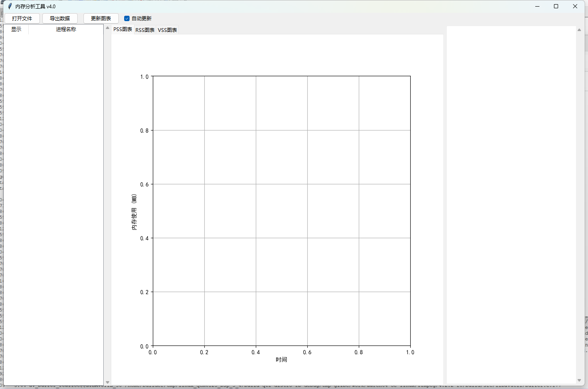
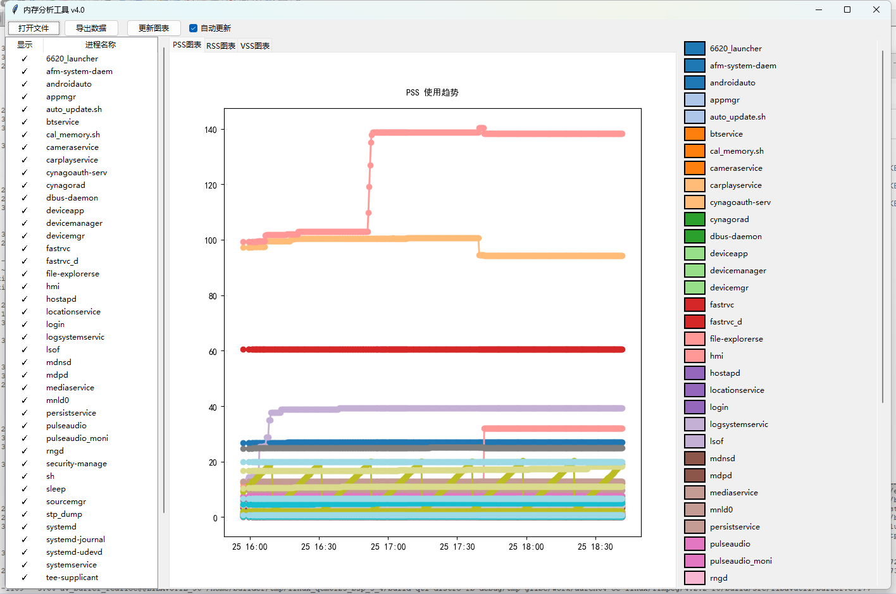

# ProcessMemoryMonitor 内存分析工具使用说明

## 工具概述
ProcessMemoryMonitor 是一个用于Linux系统内存分析的可视化工具，包含两个核心组件：
- [ProcessMemoryMonitor.sh](./ProcessMemoryMonitor.sh)：Shell脚本用于收集系统进程内存数据
- [ProcessMemoryMonitor.py](./ProcessMemoryMonitor.py)：Python程序用于数据可视化展示

## 功能特点
1. 支持PSS/RSS/VSS三种内存指标分析
2. 提供动态图表展示内存变化趋势
3. 支持多进程同时对比分析
4. 可交互式操作（选择显示进程、自动/手动更新）
5. 支持数据导出为Excel/CSV格式

## 使用步骤

### 1. 数据收集
```bash
chmod +x ProcessMemoryMonitor.sh
./ProcessMemoryMonitor.sh [输出目录]
```


示例：
```bash
# 在当前目录生成数据文件
./ProcessMemoryMonitor.sh

# 指定输出目录
./ProcessMemoryMonitor.sh /home/user/memory_logs
```


该脚本会：
- 扫描 `/proc` 目录下的所有进程
- 收集每个进程的PSS/RSS/VSS内存数据
- 按时间戳生成结构化文本文件 [ProcessMemoryData.txt](./TestData/ProcessMemoryData.txt)

### 2. 数据分析
运行Python程序加载生成的数据文件：
```bash
python ProcessMemoryMonitor.py
```


操作指南：
1. 点击"打开文件"按钮加载生成的 [ProcessMemoryData.txt](./TestData/ProcessMemoryData.txt)
2. 左侧进程列表中勾选要分析的进程
3. 自动在右侧图表区域显示内存使用趋势
4. 可通过图例区域滚动条查看所有进程的图例信息
5. 可点击"导出数据"将分析结果保存为Excel或CSV文件

运行前：

运行后：


### 3. 界面功能说明
| 区域 | 功能说明 |
|------|----------|
| 工具栏 | 提供文件打开、数据导出、手动更新和自动更新开关 |
| 进程列表 | 显示所有检测到的进程，可通过复选框控制图表显示 |
| 图表区域 | 展示PSS/RSS/VSS三种内存指标的趋势图（可切换标签页） |
| 图例区域 | 显示各颜色对应进程的图例，支持垂直滚动 |

### 4. 高级特性
- **自动更新**：开启后会在数据文件修改时自动刷新图表
- **延迟加载**：避免高频更新导致界面卡顿
- **中文支持**：图表标题等文本支持中文显示
- **颜色管理**：为每个进程分配独立颜色，便于对比分析

## 输出文件格式说明
生成的 [ProcessMemoryData.txt](./TestData/ProcessMemoryData.txt) 文件包含以下内容：
1. 统计时间戳
2. 表头定义（PROCESS, PSS(MB), RSS(MB), VSS(MB)）
3. 各进程的内存使用数据
4. 总内存使用统计

每条记录包含：
- 进程名称 (Name)
- PSS内存值 (单位MB)
- RSS内存值 (单位MB)
- VSS内存值 (单位MB)

## 注意事项
1. Shell脚本需要在Linux环境下运行
2. Python程序需要Python 3.6+环境
3. 建议使用最新版本matplotlib以获得最佳显示效果
4. 大量进程数据分析时请确保足够的系统资源
5. 自动更新功能建议在数据采集周期与图表刷新间隔匹配时使用


## 版本历史
- v4.0: 新增自动更新、延迟加载、改进图例显示、优化性能
- v3.x: 初始版本实现基本功能

## 致谢
感谢使用本工具进行内存分析，如发现任何问题欢迎反馈。