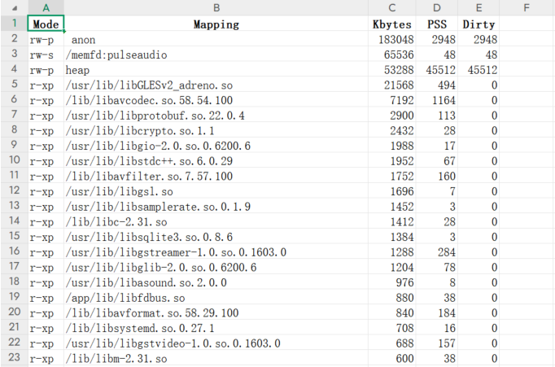

# LinuxMemoryAnalysisTools 
Linux内存分析工具

## 仓库概述

本仓库用于开发Linux便利性的内存分析工具，旨在Linux内存分析时进行快速的数据可视化
本仓库包含以下工具：

1、ProcessMemoryMonitor 进程内存分析工具
- [README.md](./ProcessMemoryMonitor/README.md)：进程内存分析工具的README.md

- 示例图如下：

2、pmap 的数据统计
- [README.md](./pmap_analyzer/README.md): pmap 的数据统计成表格数据，查看每一个mapping的内存占用

- 示例图如下：

